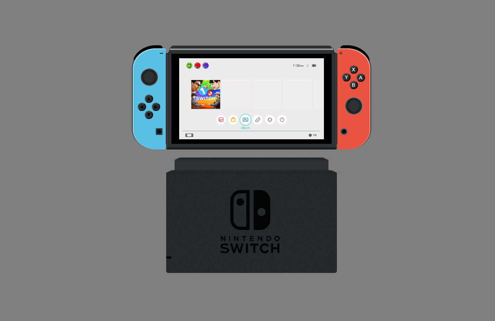
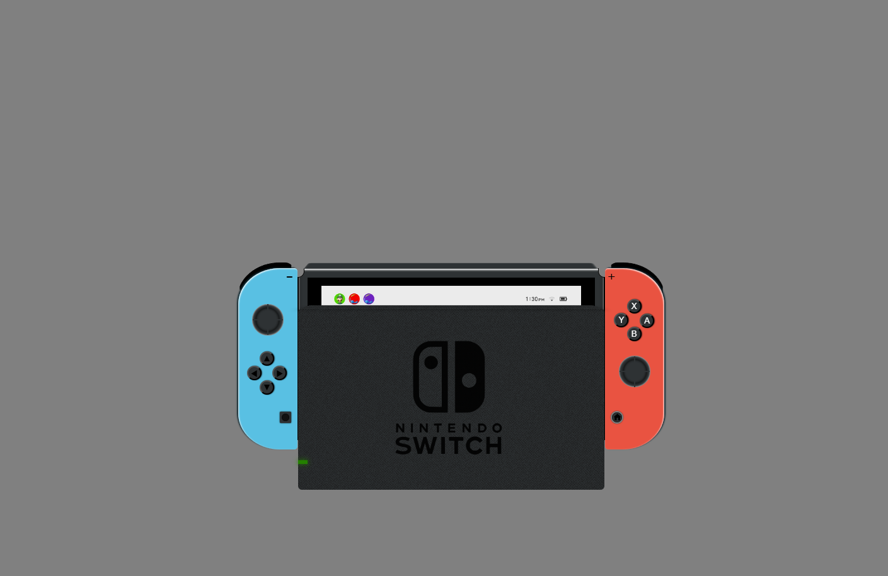

# Nintendo Switch CSS Art

A playful CSS-only recreation of the Nintendo Switch console and docking station, built as a small Vite-based web experiment.

## Overview

This project showcases how modern HTML, CSS, and Web Components can be combined to build a stylized, animated replica of a Nintendo Switch. The interface is composed of reusable custom elements and layered CSS styling to recreate the console, controllers, and dock.

## Features

- **Custom Web Components** for the console, dock, and controllers
- **Animated console movement** to give the scene a dynamic feel
- **Modern Vite setup** for fast local development and production builds
- **Simple, lightweight structure** without external UI libraries

## Tools and Technologies

- **HTML5**
- **CSS3**
- **Vanilla JavaScript / Web Components**
- **Vite** for development and build tooling

## Project Structure

- `index.html` – app entry point
- `src/main.js` – imports the custom elements
- `src/style.css` – global page styles
- `src/components/` – reusable Nintendo Switch UI components
- `public/` – static assets and screenshot samples

## Sample Results

### Console Preview



### Charging Console Preview



## Getting Started

### Install dependencies

```bash
pnpm install
```

### Run locally

```bash
pnpm dev
```

If you prefer not to use `pnpm`, you can also run:

```bash
npx vite
```

### Build for production

```bash
pnpm build
```

## Notes

- The current design emphasizes **CSS art and visual presentation**.
- The animated console behavior is implemented in the component layer, keeping the structure easy to extend or customize.

## Credits

Created as a CSS drawing/demo project inspired by the Nintendo Switch hardware.
